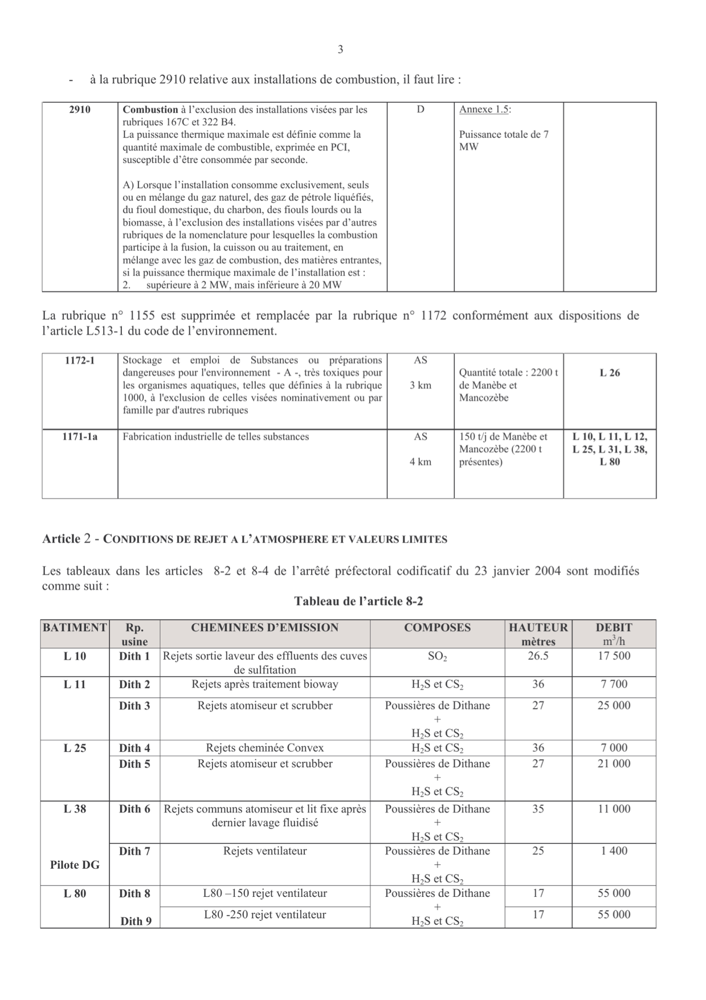
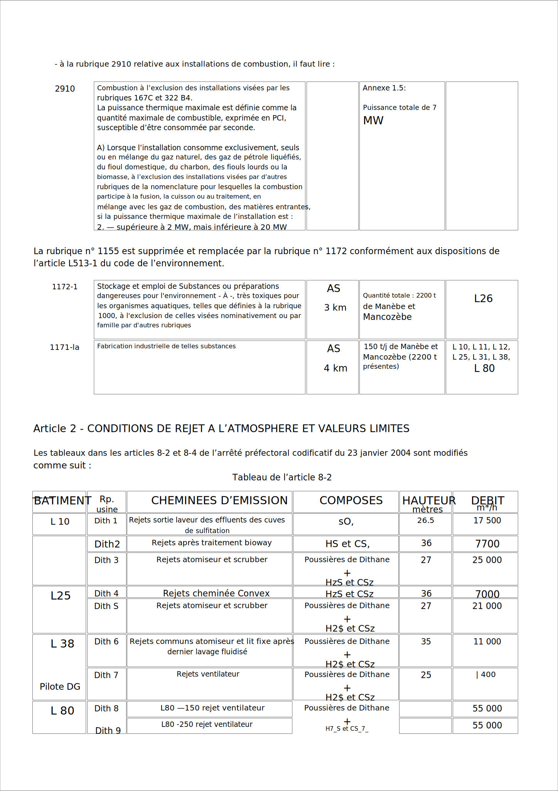

# OCR utils

[](https://github.com/envinorma/ocr_utils/actions)
[](https://envinorma.github.io/ocr_utils/)
[](https://codecov.io/gh/envinorma/ocr_utils)

Python tools for interacting with Tesseract

---

## Features

-   Detects tables in PDF/images and performs OCR on each cell
-   Performs OCR on PDF and generates SVG image

## Quick Start

```python
from ocr_utils import pdf_to_svg

pdf_to_svg(
    input_filename='in.pdf',
    output_filename='out.svg',
    detect_tables=True,
    lang='en',
)
```

## Execution example

### Input pdf



### Output svg



## Installation

**Stable Release:** `pip install tesseract_ocr_utils`<br>
**Development Head:** `pip install git+https://github.com/envinorma/ocr_utils.git`

This library is built upon [pytesseract](https://pypi.org/project/pytesseract/) and [pdf2image](https://pypi.org/project/pdf2image/) which have non-pip requirements.
Visit these libraries installation pages to install dependencies.

For example, on ubuntu, the following libraries need to be installed:

```bash
apt-get install libarchive13
apt-get install tesseract-ocr
apt-get install poppler-utils
```

## Documentation

For full package documentation please visit [envinorma.github.io/ocr_utils](https://envinorma.github.io/ocr_utils).

## Development

See [CONTRIBUTING.md](CONTRIBUTING.md) for information related to developing the code.

**MIT license**
